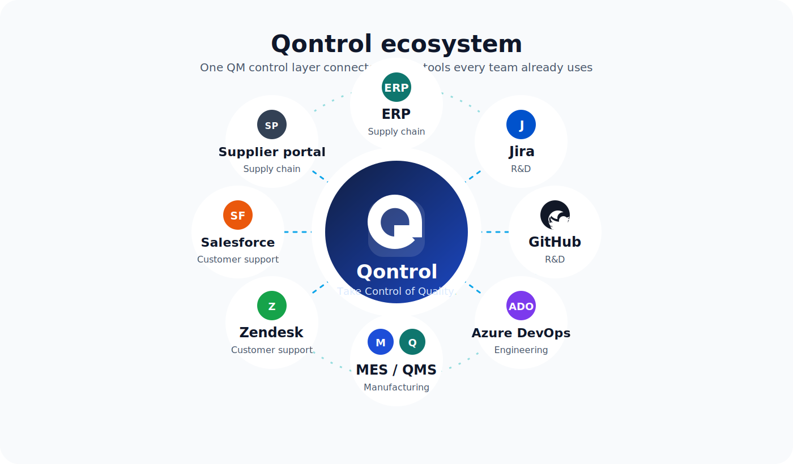
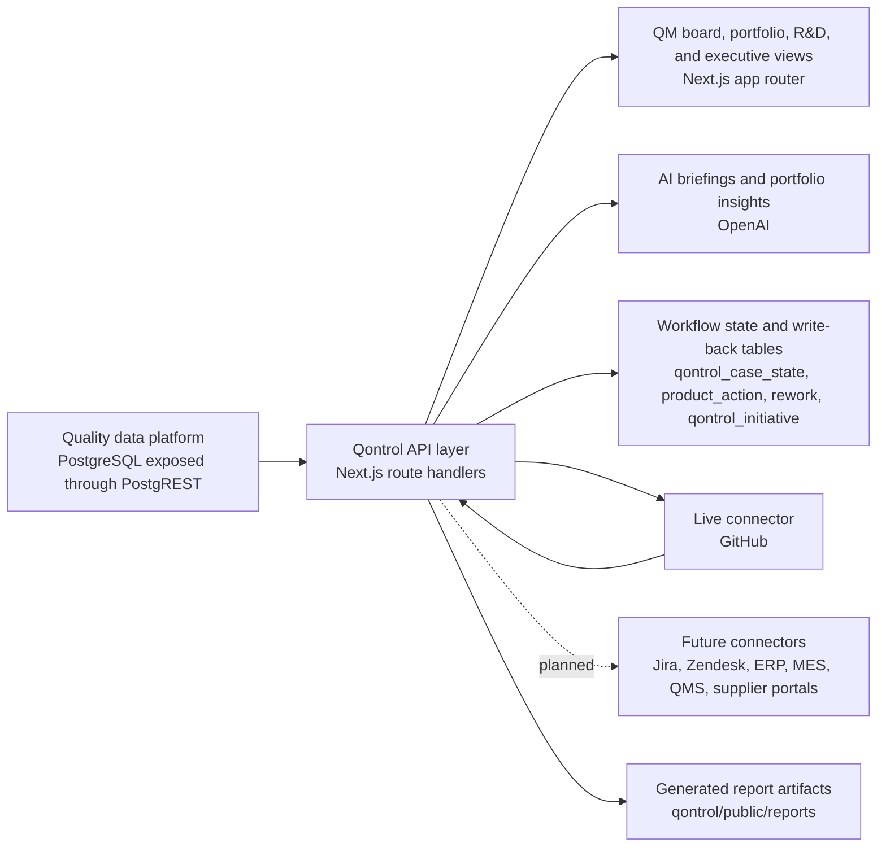

# 🎯 Qontrol


Qontrol gives quality teams one control tower for routing, follow-up, and portfolio insight.

<p align="center">
  <a href="https://codexmanexqontrol.vercel.app/">
    
  </a>
</p>
<p align="center">
  <strong><a href="https://codexmanexqontrol.vercel.app/">Take Qontrol Now</a></strong><br />
  <sub>Plain link if your viewer does not show the button image above.</sub>
</p>



⚡ Quality issues move across functions fast. Ownership does not.

📁 The full-stack app lives in the `qontrol/` folder of this repository.

Qontrol is a web app for the quality management lead. It helps QM make two decisions well:

- 🧭 Which team should own this case now
- 📊 Which patterns should management act on next

The first decision is triage. The second is portfolio management and strategy.

## 🧩 Problem

Quality teams sit in the middle of every cross-functional issue:

- QM receives the signal first, but does not always own the fix
- R&D, customer support, supply chain, and manufacturing work in different systems
- Context gets rebuilt in meetings, email threads, and spreadsheets
- Leadership sees ticket volume, but not the pattern behind the volume

In a real organization, R&D often works in Jira, GitHub, or Azure DevOps. Customer support often works in Zendesk or Salesforce Service Cloud. Supply chain and manufacturing often work in ERP, MES, QMS, or supplier workflows. A single tool for every user usually fails. A focused tool for QM, with strong handoffs into downstream systems, fits the way the work already happens.

## 💡 Solution

Qontrol gives QM one place to run the full quality loop.

At the case level, it helps teams triage the issue, review evidence, route ownership, and keep follow-up moving. At the portfolio level, it helps leaders spot repeat patterns, compare risk across products and functions, and decide where to act next.

That means one product supports both day-to-day operational triage and higher-level strategy decisions, while still fitting into the way each function already works.

## 🧭 Design Choice

Qontrol is not a new all-in-one workspace for every function.

It is a control layer for QM.

That choice matters. It is not realistic to ask every team to move into one shared tool. People work better when they stay in the systems they already know, and when information is presented in a way that fits their use case. Qontrol keeps QM in control of the cross-functional flow, while R&D, customer support, supply chain, and manufacturing stay comfortable in the tools they prefer. Qontrol sits above those tools, creates the handoff, and keeps the thread connected.

The same discipline applies to AI. Qontrol does not use AI for the sake of AI. We only add it when it clearly benefits users, and we put real thought into where it belongs before it ships. In the product, AI is treated like any other tool: it has to earn its place in the workflow.

## ✨ Features

- 📋 QM board for defect and claim triage
- 🔍 Ticket detail workspace with evidence, similar issues, and routing context
- 🔗 Combined routing flow for related cases
- 🌐 Cross-functional handoff model that fits the tools other departments already use
- 🐙 GitHub issue creation and webhook sync for the live R&D flow
- ✅ QM verification and closed-loop tracking
- 🧪 R&D portfolio and per-case decision workspace
- 📈 Portfolio dashboards with trend, Pareto, severity, cost, and claim-lag views
- 🧠 AI-generated briefings, recommendations, and chat-based portfolio analysis
- 📑 Executive report generation for management review

## 🗺️ Product Tour

- `/` for the QM control board, ticket detail workspace, routing actions, and case history
- `/portfolio` for portfolio dashboards across defects, claims, severity, cost, and lag
- `/portfolio/learnings` for grounded insights, recommendations, and initiative capture
- `/rd` for the R&D queue and decision flow
- `/ceo-report` for the executive summary and report generation flow

## 🚀 Quick Start

From the repository root:

```bash
cd qontrol
cp .env.example .env.local
npm install
npm run dev -- --hostname 127.0.0.1 --port 3005
```

Open [http://127.0.0.1:3005](http://127.0.0.1:3005).

## 🛠️ Setup

### 📋 Requirements

- Node.js
- npm
- Access to the quality data API
- An OpenAI API key for server-side briefings and insights
- A GitHub token for the R&D connector flow

### 🔐 Environment Variables

Inside `qontrol/`, create `.env.local` from `.env.example`, then set:

- `MANEX_API_URL`: PostgREST base URL for your team environment
- `MANEX_API_KEY`: anon API key for the shared dataset
- `OPENAI_API_KEY`: server-side key for briefings, recommendations, and chat
- `OPENAI_MODEL`: optional model override
- `QONTROL_PUBLIC_BASE_URL`: public base URL used for deep links
- `GITHUB_TOKEN`: GitHub personal access token with issue and project write access
- `GITHUB_REPO_OWNER`: GitHub owner for downstream ticket creation
- `GITHUB_REPO_NAME`: GitHub repository for downstream ticket creation
- `GITHUB_PROJECT_OWNER`: optional GitHub Project owner
- `GITHUB_PROJECT_OWNER_TYPE`: `user` or `org`
- `GITHUB_PROJECT_NUMBER`: optional GitHub Project number
- `GITHUB_WEBHOOK_SECRET`: secret used to verify GitHub webhook deliveries

## 🔄 How It Works

- A new defect or field claim appears in the QM board
- QM reviews the case, supporting evidence, and related tickets
- Qontrol recommends the likely destination team and explains why
- QM routes the case into the downstream workflow. The live handoff today is GitHub for the R&D flow
- The destination team reviews the issue in its own system and sends a decision or status update back
- QM verifies closure and keeps the operational record aligned
- The portfolio layer turns many case-level events into trends, recommendations, and executive summaries

## 🔗 Integrations

### ✅ Live Today

- GitHub issue creation for the R&D handoff
- GitHub webhook sync for status updates and case tracking
- OpenAI for briefings, portfolio insights, grounded chat, and discussion summarization

### 🔜 Planned Connectors

- Jira and Azure DevOps for engineering teams that do not run on GitHub
- Zendesk and Salesforce for customer support workflows
- ERP, MES, and QMS connectors for supply chain and manufacturing actions
- Supplier portal handoffs for vendor-facing quality cases
- Email, SLA, and escalation automation

## 🧠 AI Philosophy

Qontrol does not use AI for the sake of AI.

We use AI when it helps customers make a better decision, move faster, or understand the portfolio more clearly. In Qontrol, AI is part of the workflow. It helps summarize evidence, explain routing rationale, surface repeat patterns, and turn large volumes of tickets into useful recommendations. It is not treated as a separate novelty layer. It is another tool inside the product.

## 🏗️ Architecture



### 🖥️ Frontend

- Next.js 16, React 19, and TypeScript
- App Router pages for QM, portfolio, R&D, and executive reporting
- Recharts dashboards for portfolio and department-level views

### ⚙️ Backend

- Next.js route handlers power case retrieval, routing, close-out, dashboards, R&D actions, AI summaries, and report generation
- The app reads live quality data through a PostgREST layer instead of copying data into a separate ticket store
- App-specific workflow state is stored in dedicated write-back tables

### 🗄️ Data Model

Qontrol reads from live quality views and tables such as:

- `v_defect_detail`
- `v_field_claim_detail`
- `v_quality_summary`
- `product`
- `supplier_batch`
- `test_result`

Qontrol writes back to:

- `qontrol_case_state` for workflow state and history
- `product_action` for assignment and follow-up actions
- `rework` for close-out records tied to defects
- `qontrol_initiative` for portfolio recommendations users choose to track

## 📌 Roadmap

- More downstream connectors across engineering, customer support, supply chain, and manufacturing
- Stronger workflow automation for approvals, reminders, and escalations
- Richer executive rollups across departments, suppliers, and product lines
- Broader closed-loop reporting on time to ownership, time to decision, and time to resolution

## ✔️ Verification

```bash
cd qontrol
npm run build
npm run lint
```
